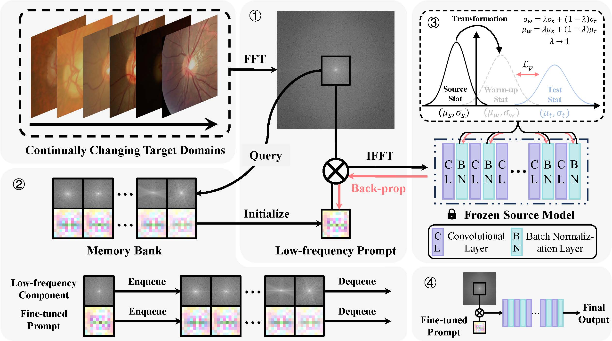

# :page_facing_up: VPTTA
This is the official pytorch implementation of our CVPR 2024 paper "[Each Test Image Deserves A Specific Prompt: Continual Test-Time Adaptation for 2D Medical Image Segmentation](https://arxiv.org/pdf/2311.18363.pdf)".

<div align="center">
  
</div>

## Environment
```
CUDA 10.1
Python 3.7.0
Pytorch 1.8.0
CuDNN 8.0.5
```
Our Anaconda environment is also available for download from [Google Drive](https://drive.google.com/file/d/1vAEyFrJ_wLiLwNJfBTg6J-wC9CbzCLmn/view?usp=sharing).

Upon decompression, please move ```czy_pytorch``` to ```your_root/anaconda3/envs/```. Then the environment can be activated by ```conda activate czy_pytorch```.

## Data Preparation
The preprocessed data can be downloaded from [Google Drive](https://drive.google.com/drive/folders/1axgu3-65un-wA_1OH-tQIUIEHEDrnS_-?usp=drive_link).

## Pre-trained Models
Download pre-trained models from [Google Drive](https://drive.google.com/drive/folders/1WWRbFLN3ELGbNs9jnl5bt4bIHuha8jWw?usp=drive_link) and drag the folder 'models' into the folder 'OPTIC' or 'POLYP'.

You can also train your own models from scratch following:

* **OD/OC Segmentation**
```
CUDA_VISIBLE_DEVICES=0 python OPTIC/train_source.py --Source_Dataset RIM_ONE_r3 --path_save_log OPTIC/logs --path_save_model OPTIC/models --dataset_root your_dataset_root
```
* **Polyp Segmentation**

Please refer to the Pytorch implementation of [PraNet](https://github.com/DengPingFan/PraNet).

## How to Run
Please first modify the root in ```VPTTA_OPTIC.sh``` and ```VPTTA_POLYP.sh```, and then run the following command to reproduce the results.
```
# Reproduce the results on the OD/OC segmentation task
bash VPTTA_OPTIC.sh
# Reproduce the results on the polyp segmentation task
bash VPTTA_POLYP.sh
```

## Citation ✏️
If this code is helpful for your research, please cite:
```
@article{chen2023vptta,
  title={Each Test Image Deserves A Specific Prompt: Continual Test-Time Adaptation for 2D Medical Image Segmentation},
  author={Chen, Ziyang and Ye, Yiwen and Lu, Mengkang and Pan, Yongsheng and Xia, Yong},
  booktitle={Proceedings of the IEEE/CVF Conference on Computer Vision and Pattern Recognition},
  pages={11184-11193},
  year={2024}
}
```
## Acknowledgement
Parts of the code are based on the Pytorch implementations of [DoCR](https://github.com/ShishuaiHu/DoCR), [DLTTA](https://github.com/med-air/DLTTA), and [DomainAdaptor](https://github.com/koncle/DomainAdaptor).

## Contact
Ziyang Chen (zychen@mail.nwpu.edu.cn)
